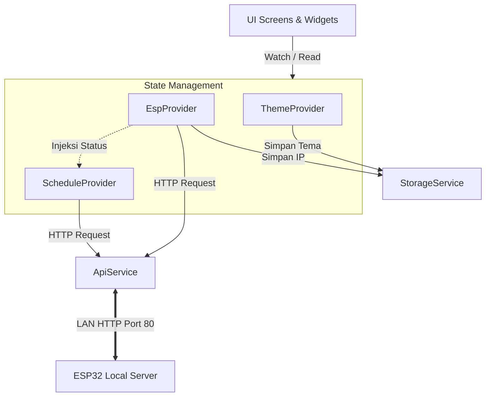

# R-Sync (Relay-Sync) Client App 🌐📱💻

Aplikasi kontrol dan pemantau relai cerdas multiplatform (*Cross-Platform Client*) untuk perangkat mikrokontroler **ESP32 Local Server**. Aplikasi ini mendukung sistem operasi **Android, iOS, Web, Windows, macOS, dan Linux** secara *native* tanpa ketergantungan pada server cloud pihak ketiga (*100% Local LAN Communication*).

- **Repositori Aplikasi Flutter**: [https://github.com/Zenalghi/r_sync_app](https://github.com/Zenalghi/r_sync_app)
- **Firmware ESP32 Terkait**: [https://github.com/Zenalghi/relay-local-server](https://github.com/Zenalghi/relay-local-server)
- **Framework**: Flutter 3 (Dart SDK ^3.13)
- **Arsitektur State Management**: Provider (MVVM / Controller Pattern)

---

## 📑 Daftar Isi
1. [Fitur Utama](#-fitur-utama)
2. [Desain Sistem & Estetika](#-desain-sistem--estetika)
3. [Arsitektur Navigasi Adaptif](#-arsitektur-navigasi-adaptif)
4. [Struktur Folder Proyek](#-struktur-folder-proyek)
5. [Alur Arsitektur & State Management](#-alur-arsitektur--state-management)
6. [Kontrak Komunikasi REST API ESP32](#-kontrak-komunikasi-rest-api-esp32)
7. [Panduan Menjalankan & Build Aplikasi](#-panduan-menjalankan--build-aplikasi)
8. [Manajemen Versi Aplikasi](#-manajemen-versi-aplikasi)

---

## ⚡ Fitur Utama

- **Real-Time Dual Relay Control**: Saklar ON/OFF instan untuk Relay 1 & Relay 2 dengan *optimistic UI update* dan *fallback* otomatis jika koneksi jaringan terputus.
- **Smart 4-Slot Scheduler**: Penjadwalan otomatis berbasis jam harian (masing-masing 4 slot untuk Relay 1 dan Relay 2). Dilengkapi fitur rekomendasi cerdas (*auto-alternating* ON ➡️ OFF ➡️ ON).
- **Remote OLED Display Control**: Mengganti halaman tampilan layar fisik SSD1306 di ESP32 langsung dari smartphone atau PC.
- **Remote Wi-Fi Reset**: Memicu pembukaan Captive Portal AP ESP32 secara jarak jauh dari halaman Pengaturan saat ingin memindahkan perangkat ke jaringan baru.
- **Live Connection Polling**: Memantau status jaringan, IP lokal, dan jam NTP ESP32 secara periodik di *background* (interval dapat diatur: 1s, 3s, 5s, 10s).
- **Tema Terang & Gelap (Light / Dark Mode)**: Dukungan tema visual dinamis dengan persistensi lokal via `SharedPreferences`.

---

## 🎨 Desain Sistem & Estetika

Aplikasi ini dibangun menggunakan palet warna khusus yang terinspirasi dari logo resmi `assets/icons/ico.png` dengan tipografi **Poppins**:

| Token Warna | Hex Code | Peran Visual |
| :--- | :--- | :--- |
| **Teal** | `#178697` | Aksen primer, status Relay 1 aktif, badge waktu WIB |
| **Orange** | `#EC651C` | Aksen sekunder, status Relay 2 aktif, peringatan |
| **Dark Slate / Surface**| `#181E25` / `#222A35` | Latar belakang & kartu container Dark Mode |
| **Light Card / Background** | `#F8F9FA` / `#FFFFFF` | Latar belakang & kartu container Light Mode |
| **Emerald** | `#10B981` | Indikator koneksi sukses & status job aktif |
| **Error / Crimson** | `#EF4444` | Indikator koneksi terputus & tombol hapus jadwal |

---

## 📱🖥️ Arsitektur Navigasi Adaptif (*Adaptive Navigation*)

Aplikasi menerapkan standar navigasi responsif resmi dari **Google Material 3**, **Apple Human Interface Guidelines**, dan **Microsoft Fluent Design**:

- **Mobile (Android & iOS)**: Menggunakan **Bottom Navigation Bar** yang ramah jempol untuk pengoperasian satu tangan pada layar ponsel vertikal.
- **Desktop (Windows, macOS, Linux) & Web**: Otomatis bertransformasi menjadi **Left Sidebar Navigation Rail** di sisi kiri. Dilengkapi tombol *Expand / Collapse* untuk beralih antara ikon kompak (72px) dan menu diperluas (~200px).

```text
       Mobile (Android / iOS)                    Desktop / Web (Windows, Mac, Linux, Web)
┌──────────────────────────────────────┐     ┌─────────────┬──────────────────────────────────────┐
│  [Logo] R-Sync          (IP Badge)   │     │     [☰]    │  [Logo] R-Sync          (IP Badge)   │
├──────────────────────────────────────┤     │             ├──────────────────────────────────────┤
│                                      │     │  Dashboard  │                                      │
│             BODY KONTEN              │     │  Scheduler  │             BODY KONTEN              │
│                                      │     │  Pengaturan │                                      │
├──────────────────────────────────────┤     │             │                                      │
│ [Dashboard]  [Scheduler] [Pengaturan]│     │   R-Sync    │                                      │
└──────────────────────────────────────┘     └─────────────┴──────────────────────────────────────┘
        Bottom Navigation Bar                               Left Sidebar Navigation Rail
```

---

## 📂 Struktur Folder Proyek

```text
r_sync_app/
├── assets/
│   ├── fonts/                   # Font Poppins (Regular, Medium, SemiBold, Bold)
│   └── icons/ico.png            # Icon resmi aplikasi R-Sync
│
├── lib/
│   ├── constants/
│   │   ├── app_colors.dart      # Definisi token warna desain R-Sync
│   │   └── app_theme.dart       # Konfigurasi ThemeData (Light Mode & Dark Mode)
│   │
│   ├── models/
│   │   ├── esp_status.dart      # Model parsing JSON respon /api/status ESP32
│   │   └── schedule_job.dart    # Model jadwal slot (jam, menit, aksi, aktif)
│   │
│   ├── providers/
│   │   ├── esp_provider.dart    # State management koneksi ESP32 & kontrol relay
│   │   ├── schedule_provider.dart # State management scheduler & sinkronisasi jadwal
│   │   └── theme_provider.dart  # State management tema Light/Dark mode
│   │
│   ├── screens/
│   │   ├── main_screen.dart     # Shell navigasi adaptif (BottomNav vs NavRail)
│   │   ├── dashboard_screen.dart# Kontrol relay manual & quick status
│   │   ├── scheduler_screen.dart# Daftar jadwal otomatis per relay & modal tambah
│   │   └── settings_screen.dart # Konfigurasi IP, tema, polling, & kontrol OLED
│   │
│   ├── services/
│   │   ├── api_service.dart     # Client HTTP REST API komunikasi ke ESP32
│   │   └── storage_service.dart # Wrapper SharedPreferences untuk simpan IP & tema
│   │
│   ├── widgets/
│   │   ├── add_job_modal.dart   # BottomSheet dialog pembuat jadwal baru
│   │   ├── oled_control_card.dart# Kartu pengontrol halaman layar fisik OLED
│   │   ├── relay_control_card.dart# Kartu saklar manual relay dengan efek visual
│   │   ├── schedule_card.dart   # Kartu item jadwal (dengan proteksi anti-overflow)
│   │   └── status_badge.dart    # Badge header status IP & konektivitas
│   │
│   └── main.dart                # Entry point aplikasi Flutter & MultiProvider setup
│
├── test/
│   └── widget_test.dart         # Unit & model test komprehensif (100% Passed)
│
└── pubspec.yaml                 # Manifest dependensi & konfigurasi versi aplikasi
```

---

## 🏛️ Alur Arsitektur & State Management

Aplikasi menggunakan arsitektur **Provider** yang terhubung secara modular:



### 1. `EspProvider`:
- Mengelola siklus *background polling timer* (default tiap 3 detik).
- Mengimplementasikan *optimistic update*: saat tombol relay ditekan, UI langsung berubah seketika, baru kemudian mengirim request `POST /api/relay` ke ESP32. Jika request gagal, UI otomatis *fallback* ke status asli.

### 2. `ScheduleProvider`:
- Menyinkronkan daftar jadwal lokal dengan ESP32 via `POST /api/schedule`.
- Memvalidasi batas maksimal 4 slot per channel.
- Mengurutkan jadwal secara kronologis berdasarkan total menit harian.
- Memberikan rekomendasi cerdas otomatis: jika jadwal sebelumnya adalah `ON`, form tambah jadwal berikutnya otomatis memilih `OFF`.

### 3. `StorageService`:
- Menyimpan IP default (`192.168.4.1` atau IP DHCP router seperti `192.168.100.205`) dan pilihan tema aplikasi di disk lokal via `SharedPreferences`.

---

## 📡 Kontrak Komunikasi REST API ESP32

Aplikasi berkomunikasi langsung dengan firmware ESP32 melalui endpoint berikut:

| Method | Endpoint | Fungsi | Payload Contoh |
| :--- | :--- | :--- | :--- |
| `GET` | `/api/status` | Mengambil status IP, jam NTP, relay, OLED page, & jadwal | *(None)* |
| `POST` | `/api/relay` | Menyalakan/mematikan relay secara manual | `{"channel": 1, "state": "ON"}` |
| `POST` | `/api/schedule` | Menyimpan array jadwal per relay | `{"channel": 1, "jobs": [...]}` |
| `POST` | `/api/display` | Mengganti halaman aktif layar fisik OLED ESP32 | `{"page": 1}` |
| `POST` | `/api/wifi/reset` | Mereset Wi-Fi ESP32 ke mode Captive Portal | *(None)* |

> **Catatan CORS**: Firmware ESP32 telah dilengkapi header `Access-Control-Allow-Origin: *` sehingga aplikasi klien dapat berjalan lancar di browser **Flutter Web (Chrome/Edge)** tanpa terhambat kebijakan browser CORS.

---

## 🚀 Panduan Menjalankan & Build Aplikasi

### Menjalankan Mode Development:
```powershell
# Jalankan di Android Emulator
flutter run -d emulator

# Jalankan di Browser Web (Chrome)
flutter run -d chrome

# Jalankan di Desktop Windows
flutter run -d windows
```

### Menjalankan Automated Testing:
```powershell
flutter test
```

### Memeriksa Kualitas Kode (*Static Analysis*):
```powershell
flutter analyze
```

### Menghasilkan Icon Aplikasi Multiplatform:
```powershell
dart run flutter_launcher_icons:generate
```

---

## 🏷️ Manajemen Versi Aplikasi

Versi aplikasi pada halaman Pengaturan (*Settings*) terhubung secara **otomatis dan dinamis** ke file `pubspec.yaml` melalui pustaka `package_info_plus`:

```yaml
# pubspec.yaml baris 19:
version: 1.0.0+1
```

Pengembang cukup mengubah nomor versi di `pubspec.yaml` (misalnya menjadi `version: 1.1.0+2`), maka teks pada halaman Pengaturan akan otomatis menampilkan:
`Versi 1.1.0 • ESP32 Local Server Client` tanpa perlu mengubah kode UI secara manual.

---
*Proyek ini merupakan bagian dari ekosistem open-source **R-Sync** oleh **Zenalghi** ([Aplikasi Flutter Client](https://github.com/Zenalghi/r_sync_app) • [Firmware ESP32 Local Server](https://github.com/Zenalghi/relay-local-server)).*

